# Diagrams
- [Context Diagram](#context-diagram)
- [Requirements](#requirements)
- [Class Diagram/Glossary](#class-diagramglossary)
- [Use Case Diagram](#use-case-diagram)
- [System Design](#system-design)
- [Deployment Diagram](#deployment-diagram)
- [Summary](#summary)

<h3><a href='#black-box-testing'>Testing</a></h3>

## Context Diagram
- Defines what is inside the system to be developed and what is outside (not to be developed). Define only actor and how they interact (interfaces). For explore in details the system we use [system design](#system-design).
    - 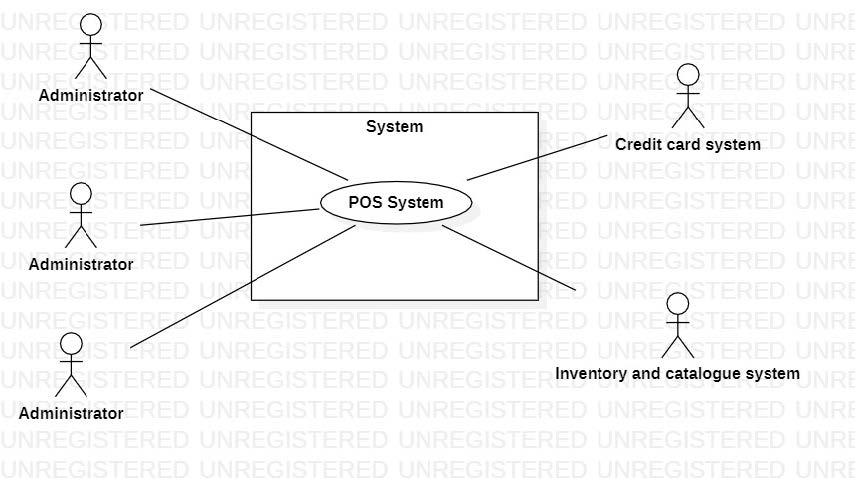
    - Outside elements are the actors, subset of the [stakeholders](#stakeholders).
    - Interactions betweeen inside and outside (system<->actors) is made with interfaces
    - 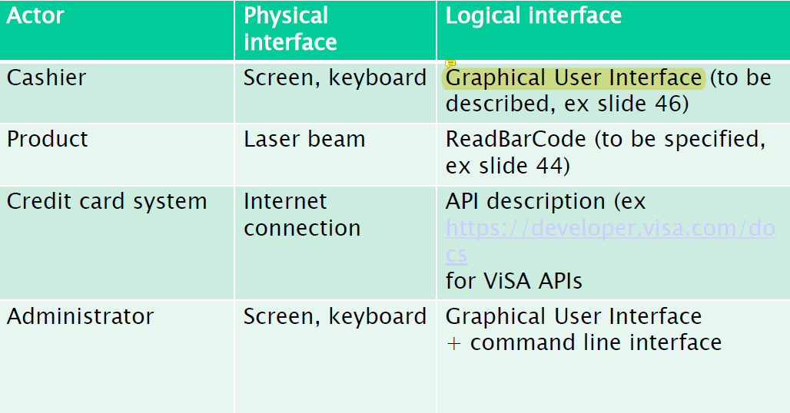
### Stakeholders
- Role person company or system that is directly or indirectly involved in the project and who may affect or get affected by the outcome of the project
## Requirements
- what is inside the system, so what's inside the box of [context diagram](#context-diagram). Represents the list of functionality that we have to deliver. 
### Functional requirements
- They describe the behaviour of the system.
- 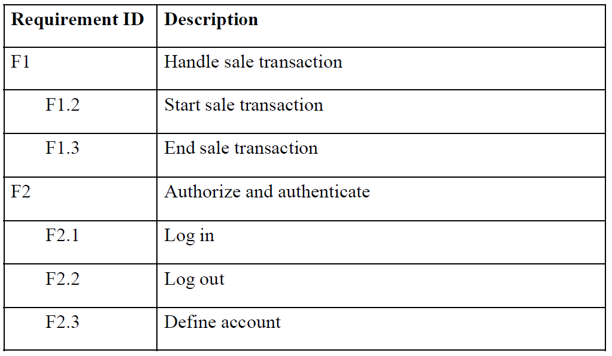
### Non Functional Requirements
- They Describe Costraint of the services/aplication/domain. They can Have 6 main propereties:
    - Functionality
    - Usability: Effort needed to learn using the product
    - Efficiency : response time or resources used (CPU,RAM,...)
    - Reliability/Availability: Number of Defect emerged over a time period or Percentage of time that the product is not available to the users.
    - Maintainability: Effort needed to add/edit/delete software functions
    - Portability: Effort to redeploy application on another platform
    - Security: Protection from Malicious Access
    - Also Domain NF requirement: Currency,Unit Of Measure,etc.
    - 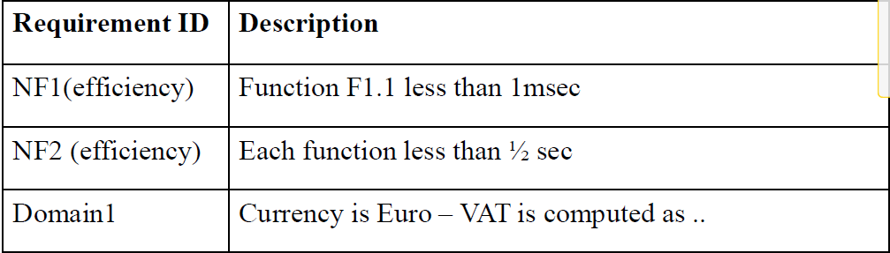
- <h3><a>ALL Non Functional Requirement must be measurable (ex. response time < 0,5 s)</a></h3>

## Class Diagram/Glossary
- Describe main classes of the application and how they interact with each other. Each class has a brief description.
- 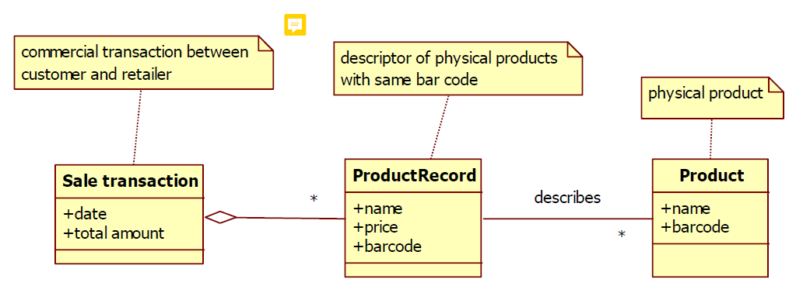
- There can be several types of cardinalities:<br>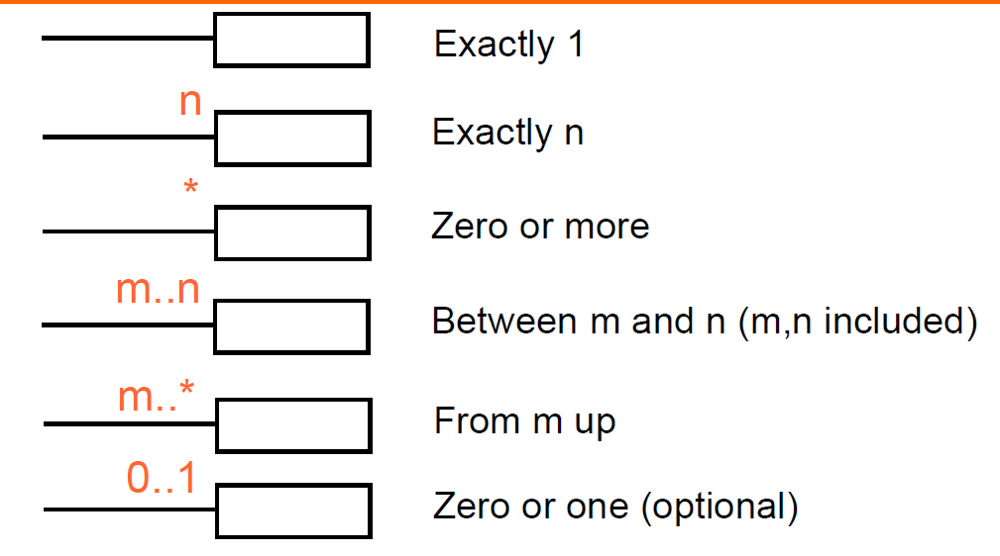
## Use Case Diagram
- Show Interaction betweeen the Actors <b><a>(Same of the Context Diagram)</a></b> and Use cases
- Example:
- 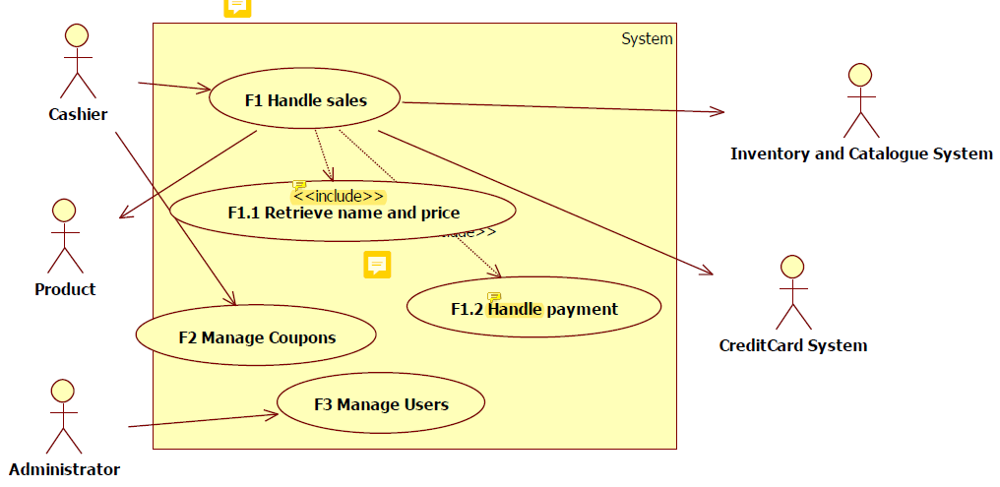
- Actor from which the arrow starts: ACTIVE ACTOR (Ex. Cashier)
- Actor who receive the arrow: PASSIVE ACTOR (Ex. Product)
- different use cases linked together ==> we use `<<include>>`. This means that some scenario (1 or also all) in F1.1 will start F1.2 (another scenario) for example (also said that F1.1 pass the control to F1.2, and before F1 pass the control to F1.1). So more complete use cases can include more simple ones.
- <h3>Other Relationships:</h3>
- 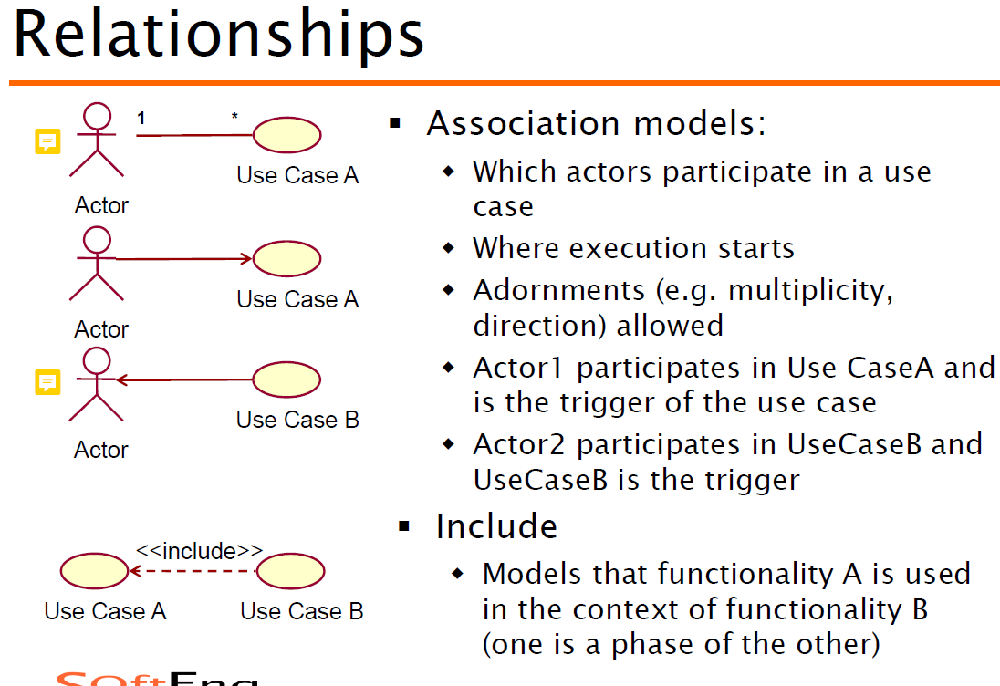
- 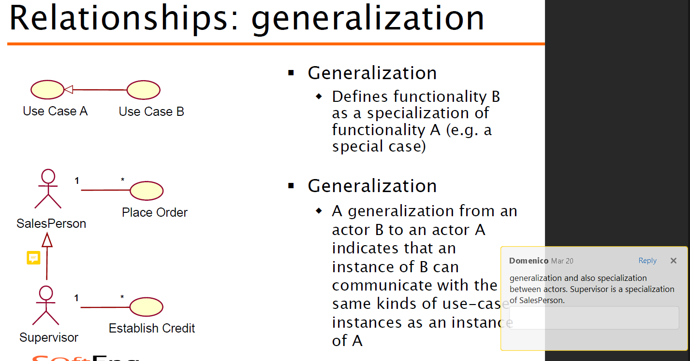
- 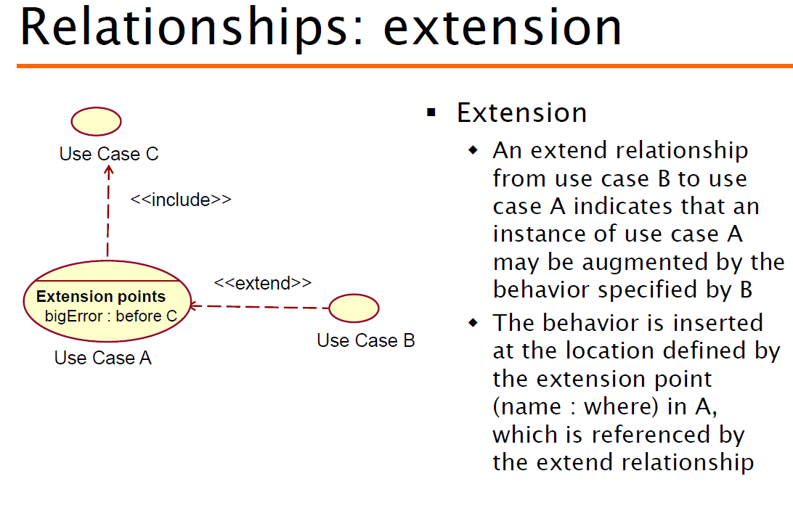 
- <h3><a>Use Cases and Scenario are used together to tell the whole story, so how everything works together</a></h3>
### Use Cases
- Set of [scenarios](#scenarios) with common user goal. Functional unit, part of the system.
- Captures a contract between the actors of a system about its behavior. Describes the systems behavior under various conditions as it responds to a request. Started from the primary actor, who interact with the system to accomplish a goal and the system responds.
- <h3><a>They are not mapped 1:1 with requirement, but almost</a></h3>
#### Scenarios
- Sequence of steps (events) describing an interaction between a user and the system
- They can have a precondition (Condition to be satisfied before starting the scenario) and a PostCondition (Condition to be satisfied at the end of the scenario)
- Example:
-   | Scenario 1.2 | Wrong password |
    | ------------- |:-------------:| 
    |  Precondition     | User not logged in, user registered | 
    |  Post condition     | User not logged in |
    | Step#        | Description  |
    |  1     | System: Ask email password. |  
    |  2     | User: Provide email, password. |
    |  3     | System: Read email, password. Check cookie,  the user is not logged in. |
    |  4	 | System: Given email, find the user. |
    |  5	 | System: Retrieve password, compare with the one provided. Passwords do not match, user is not auhorized|

## System Design
- Tell what is inside the system. Subsystems (software and not software) that compose the system. So, list of items to be delivered together. They provide the functional requirements at least, maybe also non functional requirements.
- Lists all subsystem that are <h3><a>INSIDE</a></h3> the context diagram.
- <h3><a>What is Inside System design cannot be in context diagram</a></h3>
- Correct Example:
- 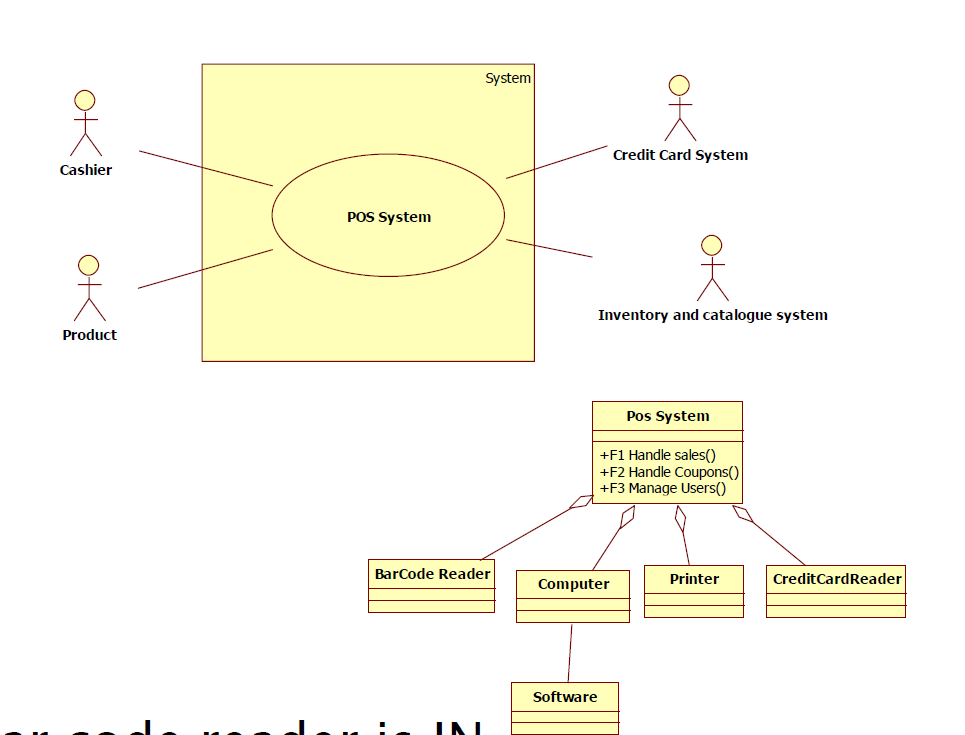
- Wrong Example:
- 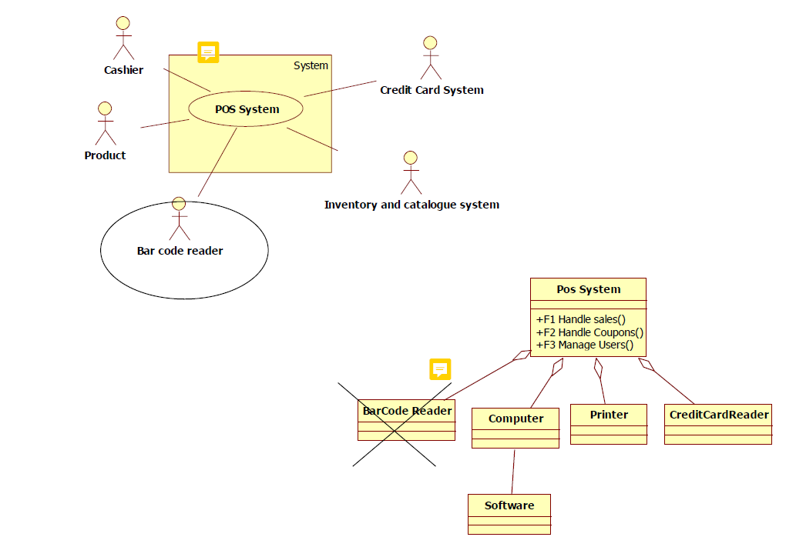

## Deployment Diagram
- Tell what will be deployed and where the software will run. Composed of:
    - Computing Component: Node (ex. server)
        - Node are connected to each others with internet links
    - Software Component: Artifact (ex. Web Application)
    - Artifact are connected with Node. We say that the artifact is deployed on the Node.
    - Example:
    - 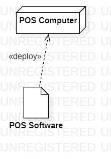

## Summary
- 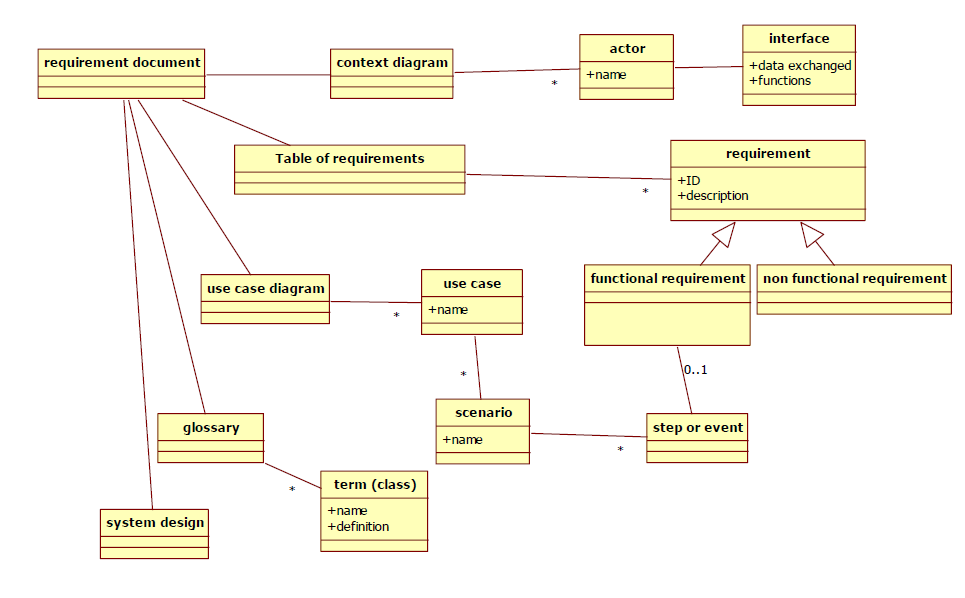

# Black Box testing:
<h3><a href='#diagrams'>Diagrams</a></h3>

## Criteria
- attribute (function parameter)
## Predicate
- condition on a attribute (also formula that involves parameter)
    - (for the formula predicate no need to consider boundaries, since that it depend on attributes)
## Boundaries
- limit values of the attribute, depending on the requirement
## Equivalence classes and Test
- one for predicate usually and test case related

# White Box testing:
## COVERAGE TYPES:
- [Node](#node-statement)
- [Edge](#edge-decision)
- [Condition](#condition)
- [Path](#path)
- [Loop](#loop)
- [Relationships](#coverage-relationships)

### Node (Statement)
- Atomic instruction. In case there are more consecutive instruction always executed they can be merged together.
``` <c>
\\ can be merged in one node
float min = 99999;
float total = 0;
int i = 0;
```
- <b>Statement coverage = Node coverage. Synonims</b>
### Edge (Decision)
- A link between nodes. Try to cover all decisions in the program with true and false.
- All Possible decision: means all possible if but also the else branch, or loop conditions
``` <c>
if(x == true) {
    ...
}
```
- <b>Edge coverage ⇔ Decision coverage. Synonims </b>
- (Edge Coverage implies Statement coverage, not viceversa)
### Condition
- Decision made of a combination of terms (== conditions)
``` <c>
if (age>60 and isRetired or isMarried) {
    ...
}
```
- This Coverage can be Simple or Multiple. 
    - Simple ==> Each condition set at least once to T and F
    - 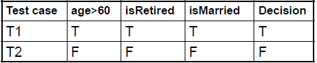
    - Multiple ==> All combinations T/F are tried
    - 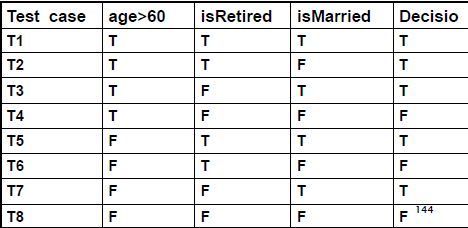
### Path
- sequence of nodes in a graph. select test cases such that every path in the graph is visited
- unfeasible if graph is cyclic. Approximations With Path–n (Ex. Path-4 == loop 0 to 4 times in each loop) or Loop coverage (In each loop cycle 0, 1 , >1 times)
- 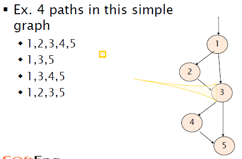
- <h3><a>COMPUTE NUMBER OF PATHS GENERAL RULES</a></h3>
 - if with return or throw statement => add 1 path
 - if => add 2 paths
 - if else => add 2 paths
 - loop as like in the example below, but there can be 1 extra path in case when is out of range and you don’t even enter the loop
```
str = 'a'; => in this case i=1, i<str.length is false (str.lenght=1), SO ANOTHER PATH FOR BEING OUT OF RANGE
if (str[0]=='-') 
    i=1;
for(; i<str.length; i++){
    ...
}

```
- <h3><a>COMPUTE NUMBER OF PATHS EXAMPLE</a></h3>
``` <c>
for (i = 0; i < 5; i++) {
    for (j = 0; j < 4; j++) {
        if (answers[i][j] == solutions[i][j] && solutions[i][j] == 1)
            grade+=3;
        else if (answers[i][j] != solutions[i][j] && solutions[i][j] == 0)
            grade-=1;
    }
}
```
    - 3 possible paths per iteration:
            - if (answers[i][j] == solutions[i][j] && solutions[i][j] == 1)
            - if (answers[i][j] != solutions[i][j] && solutions[i][j] == 0)
            - if none of the above condition is satisfied.
    - 5 * 4 = 20 total loop iterations (loop_1_iteration * loop_2_iteration)
    - Number of Paths = (Paths per Iteration)^(total loop iteration) = 3^(5*4).     VALID ONLY WHEN PATHS PER ITERATION > 1
- <h4><a>LOOP WITH ONE PATH EXAMPLE</a></h4>
    - here, according to previous formula, should be 1^(number of iteration)=1 In this way we are not taking into account the path that goes back in the loop.
    - correct way to handle this case:
- 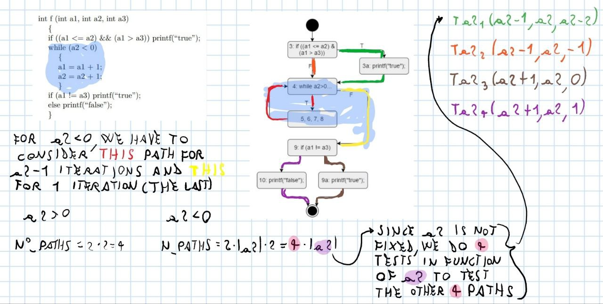
- <h4><a>HOWEWER, THIS FORMULA WORKS WHEN LOOP ARE INPUT CONTROLLED, SINCE WHEN NOT INPUT CONTROLLED, PATH IT'S ALWAYS THE SAME AND IS NOT COUNTED</a></h4>
    - in this example, we have first not input controlled loop (1 path, always the same) and two nested for loop of 9 iterations. So, 1 * 2^(9*9) paths.
```
int main() {
    int i, j;
    char str[10][50], temp[50];
    printf("Enter 10 words:");
    for ( i = 0; i < 10; ++i )
        gets(str[i]);
    for( i = 0; i < 9; ++i )
        for( j = i + 1; j < 10 ; ++j){
            if ( strcmp( str[i] , str[j] ) > 0)
            {
            strcpy(temp, str[i]);
            strcpy(str[i], str[j]);
            strcpy(str[j], temp);
            }
        }
    return 0;
}

```

- <h3><a>MORE ACCURATE FORMULA, BUT REQUIRE THE CONTROL FLOW GRAPH (ONLY FOR LINEARLY INDEPENDENT PATHS)</h3></a>
- 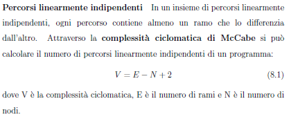
### Loop
- select test cases such that every loop boundary and interior is tested.
- 3 coverages (so formula x/3, try to reach 3 out of 3 by writing 3 test cases):
    - 0 iterations  Try No Enter
    - 1 iteration   Enter 1
    - '>' 1 iteration   Enter Many
- Example:
``` <c>
// scores ==> vector of double (float[] scores)
for (int i = 0; i < scores.length; i++){
    ...
}
// Test Cases:
T1({1}; 1) loops 1
T2({1,2,3}; 2) loops > 1
T3({}; ?) loops 0
3/3 ==> Loop Coverage 100 %
```
## Coverage Relationships
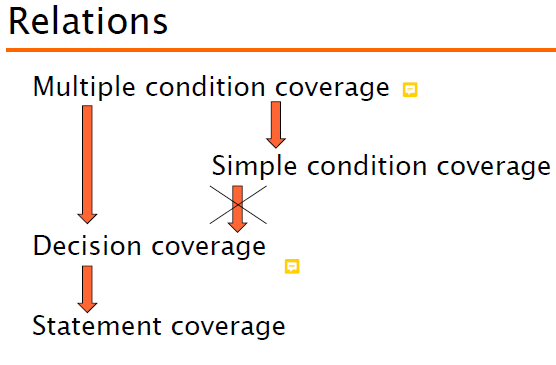

# ESTIMATION EXERCISES
- FTE: full-time equivalent (equivalente of person expected to have in another phase, such as maintenance). When there is FTE, replace the normal amount of people involved in development with this, since in maintenance this is the amount of people to invest. 
```
6 The software application (app for user + server side) has been developed custom for the company managing
the e-scooter service, over a 12 months period by 3 full time people. The company wants to operate the service
for at least 7 years, and plans 1.5 FTE per year for maintenance.
Where do you expect to have the largest part of costs ? (consider 1 year development +7 years maintenance,
consider software costs only)

    Development 12*3*1 = 36 person months = 3 person years
    Maintenance: 12*1.5*7 = 126 person months = 10.5 person years
    Maintenance costs are (according to these estimates) the major cost source
```

## OTHER NOTES
actor in context diagram ==> classes in design
element in glossary => classes in design
also there could be some classes
GUI design in parallel/ after requirement, but before design phase

in rvc the professor has used strategy approach as structural
